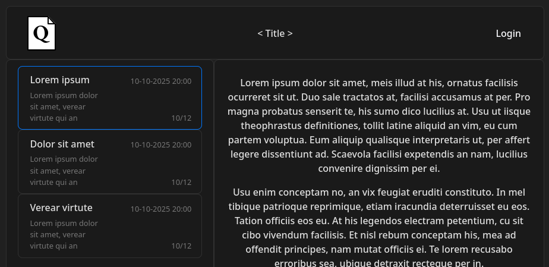

# QuRe Registration system with Queuing

## Description

Reservation System Template. A free, [open source](LICENSE) implementation of a reservation system. Easily adaptable to the needs of the user or organization.

A particular focus is in ensuring the system is provably compliant with GDPR and relevant law.

## Components:

|  | [Frontend](client/README.md) | [Backend](server/README.md) |
| -- | :--: | :--: |
| Lang | TypeScript   React | Go |
| vers. | >=5.8.3   >=19.1.1 | >=1.19 |

## Status

###### This is an ongoing project. The goal is to have an MVP implementation by 2026

### Completion estimate

|                      | Backend | Frontend | Total |
| -------------------- | :-----: | :------: | :---: |
| Reservation          |   60%   |   30%    |  47%  |
| Resuming & Modifying |   33%   |   0%     |  19%  |
| Event Creation       |   0%    |   0%     |  0%   |

## Copyright Notice

See [doc/licenses](doc/licenses/README.md)
