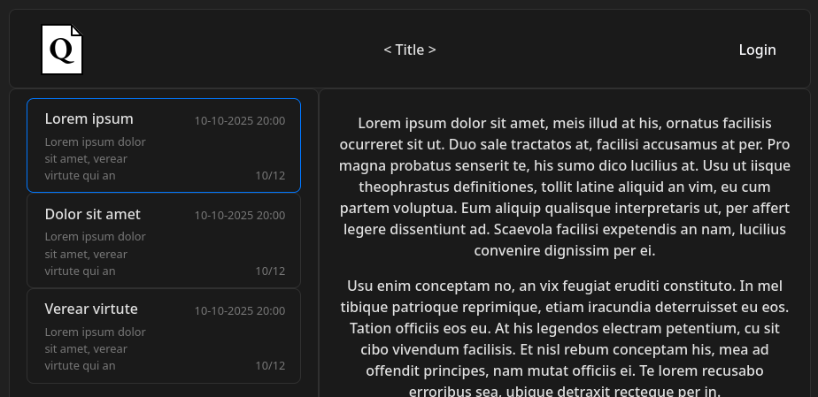

# QuRe Registration system with Queuing

[](https://github.com/JValtteri/qure/actions/workflows/frontend-tests.yml)
[](https://github.com/JValtteri/qure/actions/workflows/backend-tests.yml)
[](https://github.com/JValtteri/qure/actions/workflows/build-docker-image.yml)


## Description

Reservation System Template. A free, [open source](LICENSE) implementation of a reservation system. Easily adaptable to the needs of the user or organization.

A particular focus is in ensuring the system is provably compliant with GDPR and relevant law.




## Index

- [Description](#description)
- [Components](#components)
- [Project Status](#project-status)
- [Setting up dev enviroment](#setting-up-dev-enviroment)
- [Deploying](#deploying)
- [Copyright Notice](#copyright-notice)

#### See also:

- [**Documentation**](./doc/README.md)
    - [Dev Documentation](-/doc/dev.md)
    - [Licenses](./doc/licenses/README.md)
- **QuRe**
    - [Frontend Documentation](./client/README.md)
    - [Backend Documentation](./server/README.md) |


## Components

|       | [Frontend](./client/README.md) | [Backend](./server/README.md) |
| ----- | :-------------------: | :----: |
| Lang  | TypeScript <br> React |   Go   |
| vers. | >=5.8.3 <br> >=19.1.1 | >=1.24 |

## Deploying

```diff
- Project is in Alpha stage and its documentation is progress.
- Some features may be incomplete and/or not fully documented.
```

There are two docker image variants available:
- `ghcr.io/JValtteri/qure:latest`
- `ghcr.io/JValtteri/qure:dev`

`latest` is the newest stable **release**, intended for production use. `dev` is the tip of the main branch, which - following proper practices - should be stable, but is intended as deployment test prior to proper release.

### Run setup:
```
curl -fsSL "https://raw.githubusercontent.com/JValtteri/qure/refs/heads/main/setup.sh | sh"
```

#### See [Documentation](./doc/README.md#deploying-with-docker) for details

## Copyright Notice

See [doc/licenses](.doc/licenses/README.md)
