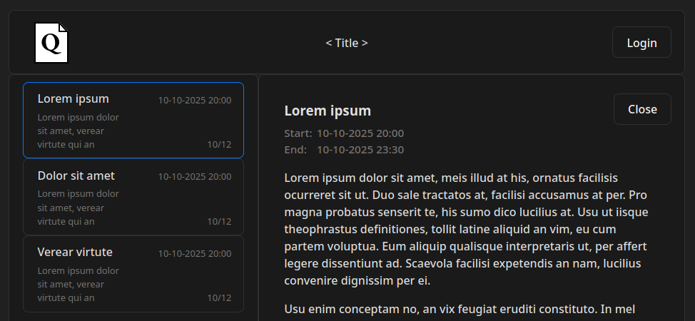

# QuRe Registration system with Queuing

## Description

Reservation System Template. A free open [source option](LICENSE) for a reservation system. Easily adaptable to the needs of the user or organization.

A particular focus is in ensuring the system is proveably compliant with GDPR and relevant law.

## Components:

|  | [Frontend](client/README.md) | [Backend](server/README.md) |
| -- | :--: | :--: |
| Lang | TypeScript   React | Go |
| vers. | ~ | >=1.19 |

## Roadmap

###### This is an ongoing project. The goal is to have an MVP implementation by 2026

### TBD

